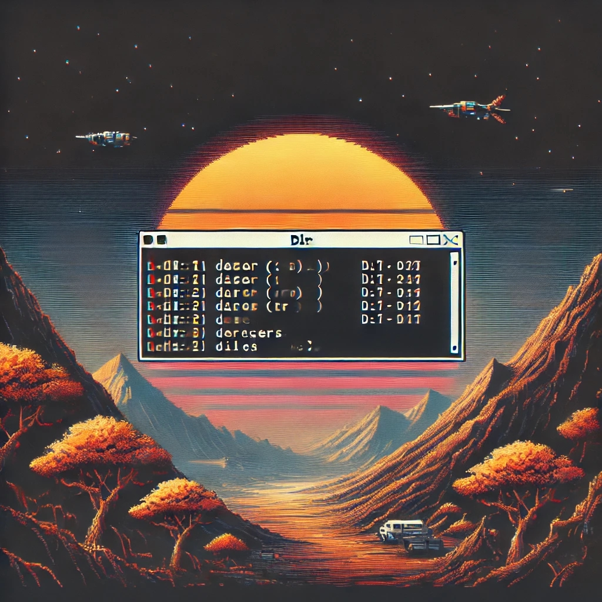
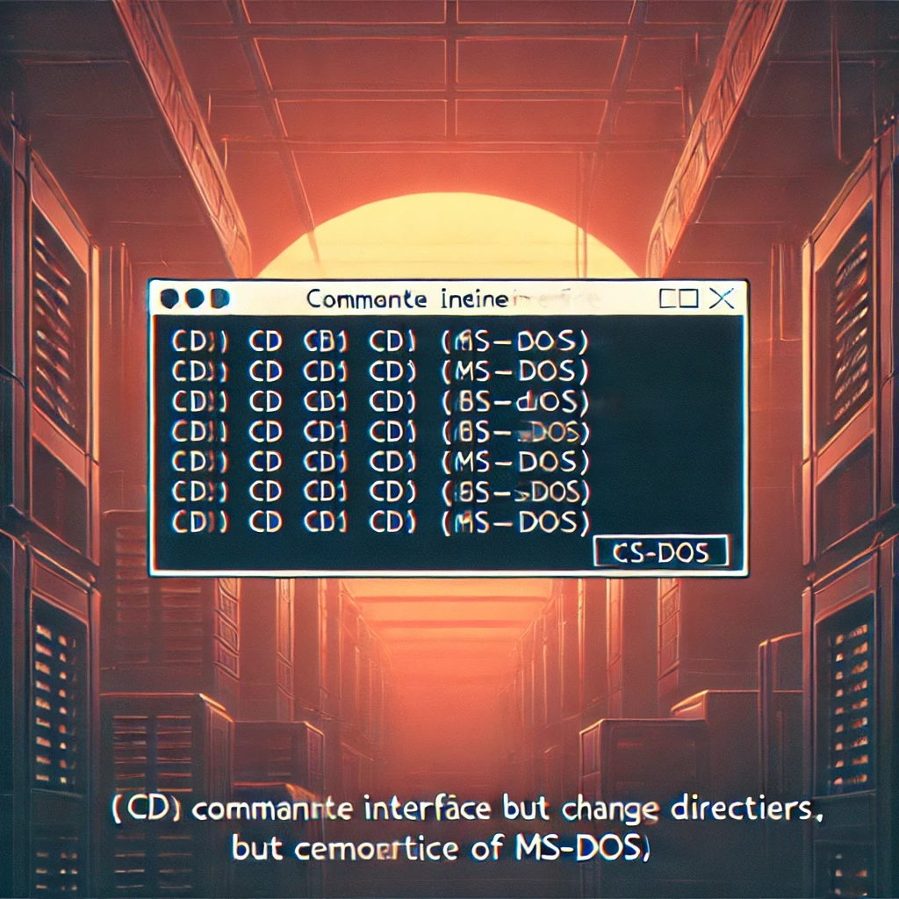
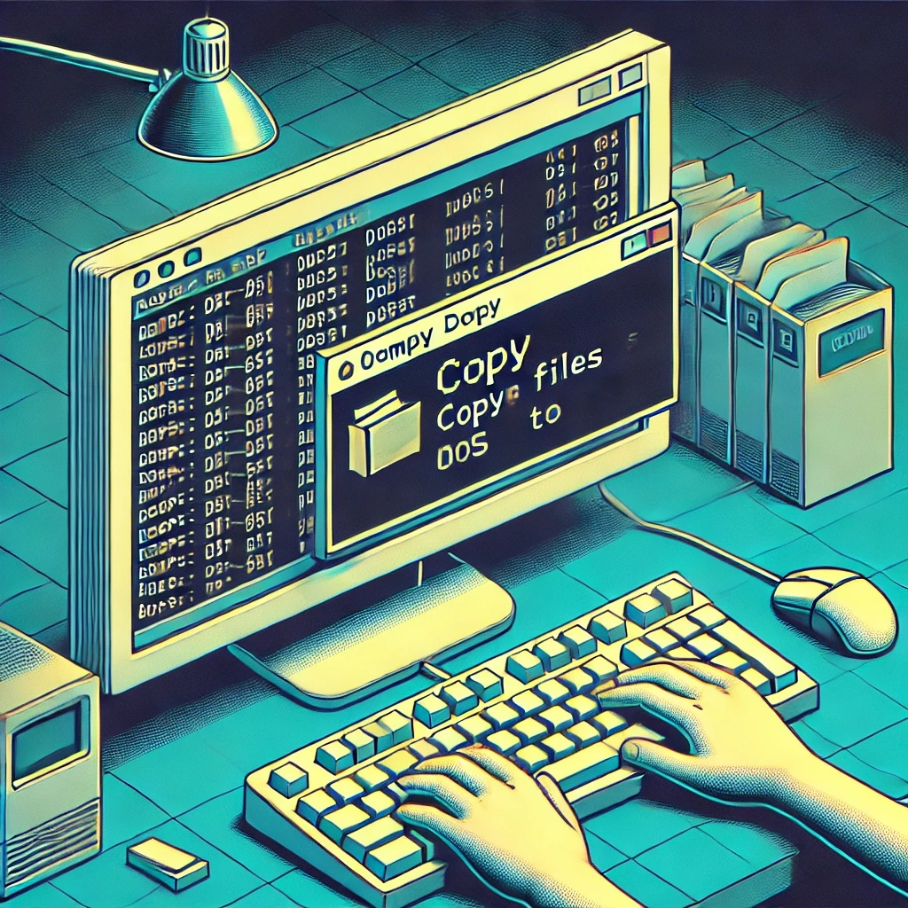
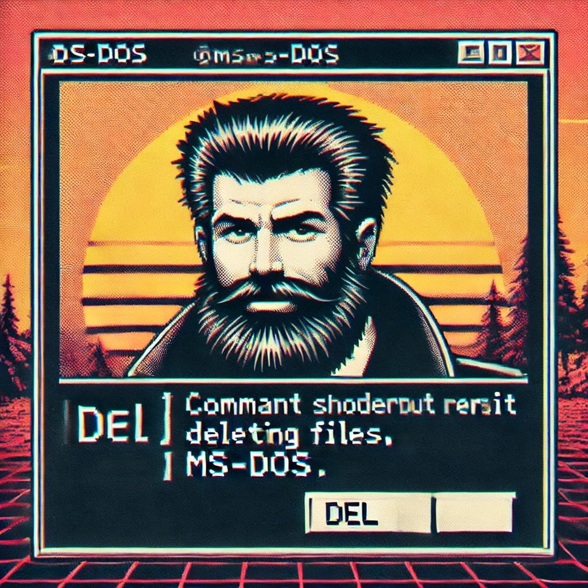
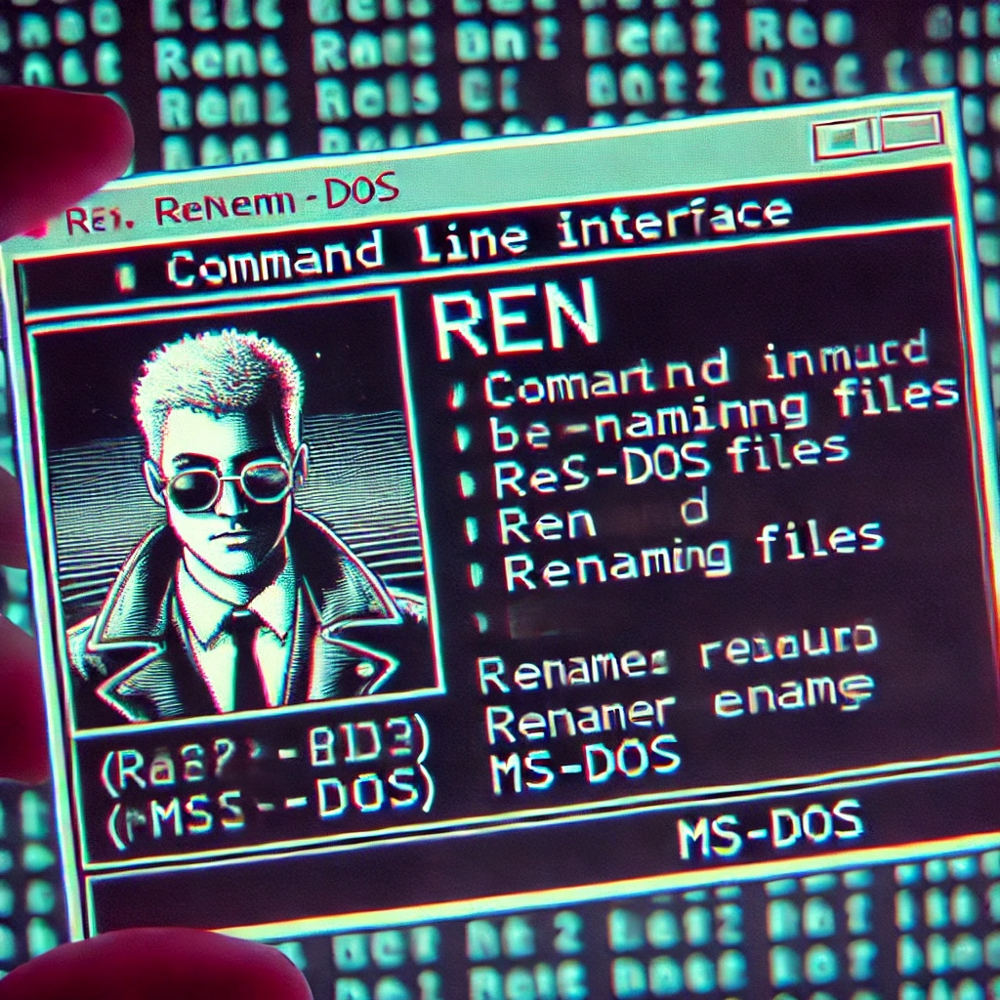

# MS-DOS: O Companheiro de Sempre da Programação

## Introdução

O MS-DOS, apesar de ser um sistema operacional dos anos 80 e 90, ainda tem sua presença marcante nos terminais das IDEs modernas. Muitos dos comandos que eram utilizados no MS-DOS são ainda úteis e práticos para desenvolvedores hoje em dia.

## Capítulo 1: A História do MS-DOS

### Origem e Evolução

O MS-DOS (Microsoft Disk Operating System) foi lançado em 1981 pela Microsoft. Originalmente baseado no 86-DOS, também conhecido como QDOS (Quick and Dirty Operating System), ele se tornou um dos sistemas operacionais mais populares para PCs durante os anos 80 e início dos anos 90.

### Impacto na Computação

O MS-DOS foi crucial no desenvolvimento de softwares e na popularização dos computadores pessoais. Ele permitiu que uma ampla gama de usuários, desde entusiastas de tecnologia até profissionais, pudessem utilizar e desenvolver aplicações para computadores.

### Transição para Windows

Com o tempo, a interface gráfica do Windows substituiu gradualmente o MS-DOS, mas a linha de comando do MS-DOS permaneceu acessível no Windows através do Prompt de Comando.

## Capítulo 2: Comandos Essenciais do MS-DOS

### DIR: Listando Arquivos e Pastas

    O comando `DIR` é utilizado para listar os arquivos e pastas no diretório atual. Nas IDEs modernas, como o VSCode, você pode utilizar comandos equivalentes para navegar e listar conteúdos do diretório.

    **Comando MS-DOS**

    DIR

    **Equivalente no terminal do VSCode**

    ls

### CD: Navegando entre Diretórios

    O comando CD permite mudar de diretório. É essencial para navegar através da estrutura de arquivos no terminal.

    **Comando MS-DOS**

    CD \Programas

    **Equivalente no terminal do VSCode**

    cd Programas

### COPY: Copiando Arquivos

    O comando COPY é usado para copiar arquivos de um local para outro. Nas IDEs modernas, a cópia de arquivos é uma tarefa comum.

    **Comando MS-DOS**

    COPY arquivo.txt \Backup

    **Equivalente no terminal do VSCode**

    cp arquivo.txt Backup/

### DEL: Deletando Arquivos

    O comando DEL serve para deletar arquivos. É utilizado com frequência para remover arquivos desnecessários ou obsoletos.

    **Comando MS-DOS**

    DEL arquivo.txt

    **Equivalente no terminal do VSCode**

    rm arquivo.txt

### REN: Renomeando Arquivos

    O comando REN é usado para renomear arquivos. Isso é útil quando você precisa organizar ou atualizar nomes de arquivos.

    **Comando MS-DOS**

    REN antigo.txt novo.txt

    **Equivalente no terminal do VSCode**

    mv antigo.txt novo.txt

## Capítulo 3: Utilizando MS-DOS nas IDEs Modernas

### MS-DOS no VSCode

No Visual Studio Code, muitos dos comandos do MS-DOS são utilizados no terminal integrado. Isso facilita a vida dos desenvolvedores, que podem usar comandos familiares para navegar, copiar, mover e deletar arquivos.

### PowerShell: A Evolução do MS-DOS

O PowerShell do Windows é uma evolução do MS-DOS, oferecendo uma interface mais poderosa e flexível. No entanto, muitos dos comandos básicos do MS-DOS ainda são compatíveis, tornando a transição suave para quem está acostumado com o MS-DOS.

    **Exemplo de comandos no PowerShell**

    Get-ChildItem   # Equivalente ao DIR
    Set-Location    # Equivalente ao CD
    Copy-Item       # Equivalente ao COPY
    Remove-Item     # Equivalente ao DEL
    Rename-Item     # Equivalente ao REN

## Importância no Cotidiano dos Desenvolvedores

Mesmo com novas ferramentas e interfaces gráficas, os comandos de linha de comando continuam sendo vitais para desenvolvedores. Eles permitem automação de tarefas, manipulação eficiente de arquivos e integração com sistemas de controle de versão, como Git.

## Conclusão

O MS-DOS, com seus comandos simples e eficazes, permanece relevante no mundo da programação. Seu legado continua vivo nos terminais modernos, facilitando o trabalho diário dos desenvolvedores e lembrando-nos da importância da persistência e evolução na tecnologia.

Ebook criado por: Izairton Oliveira de Vasconcelos
